<a href="https://www.senshicore.com/"><picture><source media="(prefers-color-scheme: dark)" srcset="assets/header.jpg">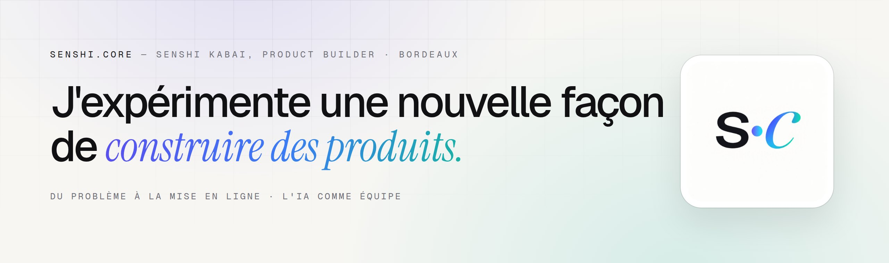</picture></a>

  
  
  

### Bonjour, je suis Senshi.

**Product Builder** à Bordeaux. Je conçois, code et mets en ligne des produits complets, **du problème à la mise en ligne**, avec l'IA comme équipe.

- **Produit** : analyse du besoin, priorisation, feuille de route, rituels agiles, mesure d'usage.
- **Réalisation** : applications web et PWA, extensions Chrome, automatisations GitHub Actions.
- **IA** : ChatGPT, Claude, Gemini et agents de code, cadrés par des consignes, des tests et une relecture humaine.
- **Avant ça** : quinze ans d'image, de 3D et de temps réel en équipe produit. L'œil pour le détail est resté.

### Les produits

<table>
<tr>
<td width="50%" valign="top"><a href="https://www.senshicore.com/projets/feed-me-odd/">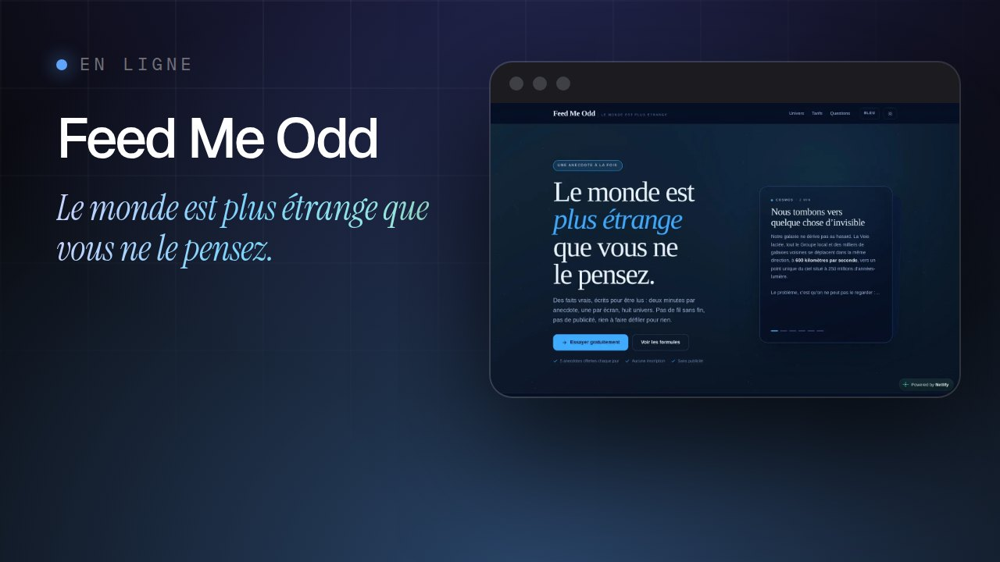</a> <a href="https://www.feedmeodd.com">Lire une anecdote</a> · <a href="https://www.senshicore.com/projets/feed-me-odd/">Fiche</a></td>
<td width="50%" valign="top"><a href="https://www.senshicore.com/projets/fable/">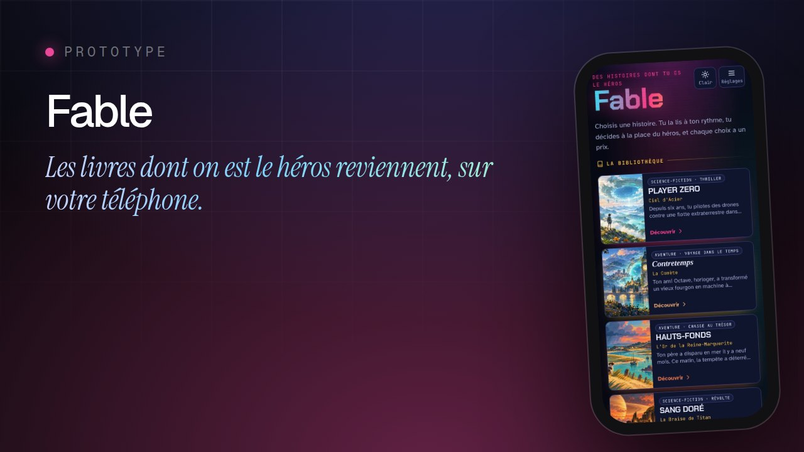</a> <a href="https://engob.github.io/PlayerZero/">Lire une histoire</a> · <a href="https://www.senshicore.com/projets/fable/">Fiche</a> · <a href="https://github.com/engoB/PlayerZero">Code</a></td>
</tr>
<tr>
<td width="50%" valign="top"><a href="https://www.senshicore.com/projets/run-forest/">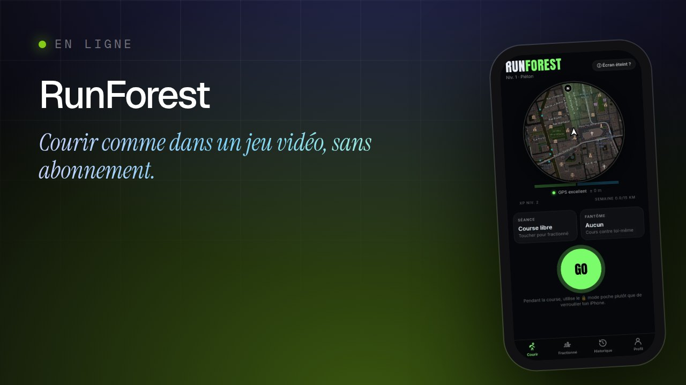</a> <a href="https://engob.github.io/RunForest/">Ouvrir l'app</a> · <a href="https://www.senshicore.com/projets/run-forest/">Fiche</a> · <a href="https://github.com/engoB/RunForest">Code</a></td>
<td width="50%" valign="top"><a href="https://www.senshicore.com/projets/iro-koku/">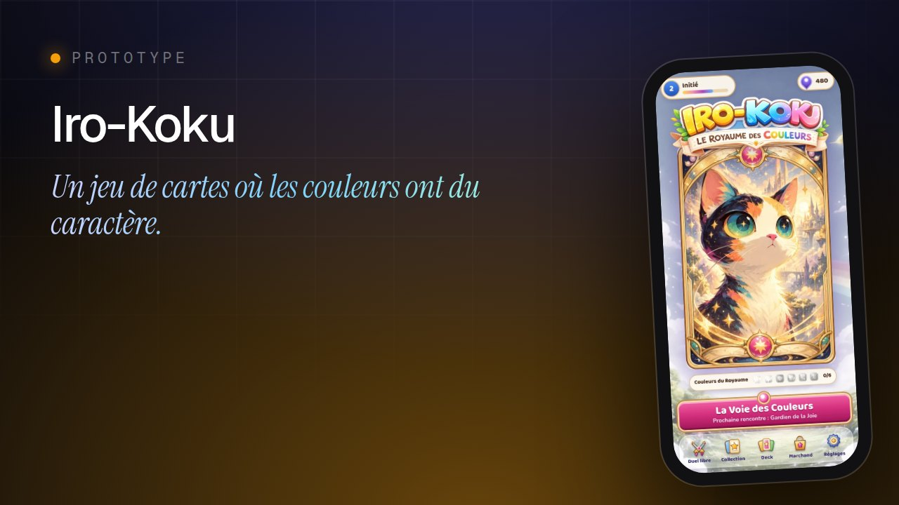</a> <a href="https://engob.github.io/IroKoku/">Jouer</a> · <a href="https://www.senshicore.com/projets/iro-koku/">Fiche</a></td>
</tr>
<tr>
<td width="50%" valign="top"><a href="https://www.senshicore.com/projets/multix-arena/">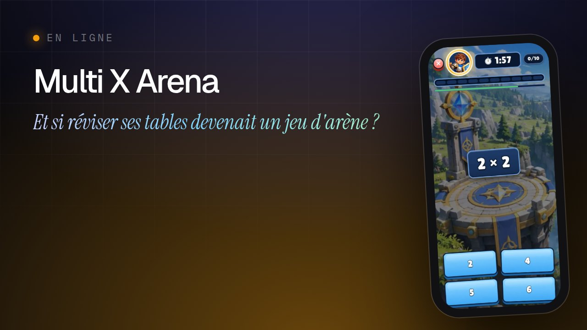</a> <a href="https://engob.github.io/MultixArena/">Jouer</a> · <a href="https://www.senshicore.com/projets/multix-arena/">Fiche</a> · <a href="https://github.com/engoB/MultixArena">Code</a></td>
<td width="50%" valign="top"><a href="https://www.senshicore.com/projets/tbm-tram-radar/">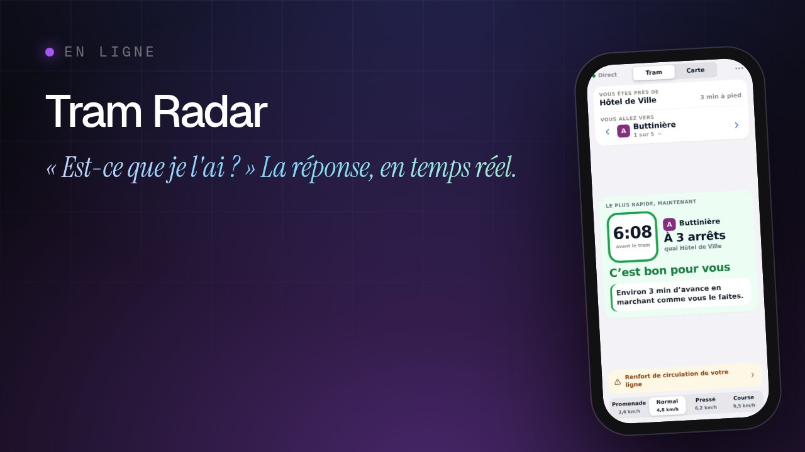</a> <a href="https://engob.github.io/TBMTramRadar/">Ouvrir l'app</a> · <a href="https://www.senshicore.com/projets/tbm-tram-radar/">Fiche</a> · <a href="https://github.com/engoB/TBMTramRadar">Code</a></td>
</tr>
<tr>
<td width="50%" valign="top"><a href="https://www.senshicore.com/projets/teletravail/">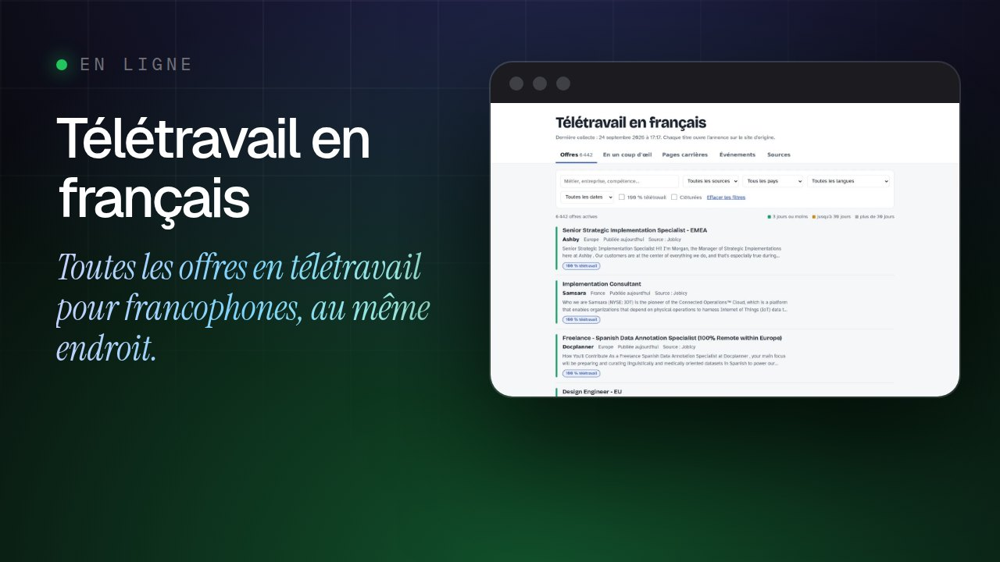</a> <a href="https://engob.github.io/Remote/">Voir les offres</a> · <a href="https://www.senshicore.com/projets/teletravail/">Fiche</a> · <a href="https://github.com/engoB/Remote">Code</a></td>
<td width="50%" valign="top"><a href="https://www.senshicore.com/projets/proofshot/">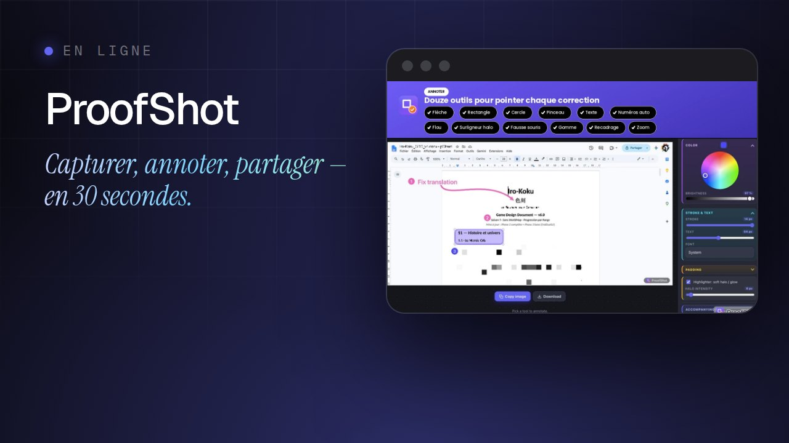</a> <a href="https://engob.github.io/proofshot/">Découvrir l'extension</a> · <a href="https://www.senshicore.com/projets/proofshot/">Fiche</a> · <a href="https://github.com/engoB/proofshot">Code</a></td>
</tr>
<tr>
<td width="50%" valign="top"><a href="https://www.senshicore.com/projets/auraplan/">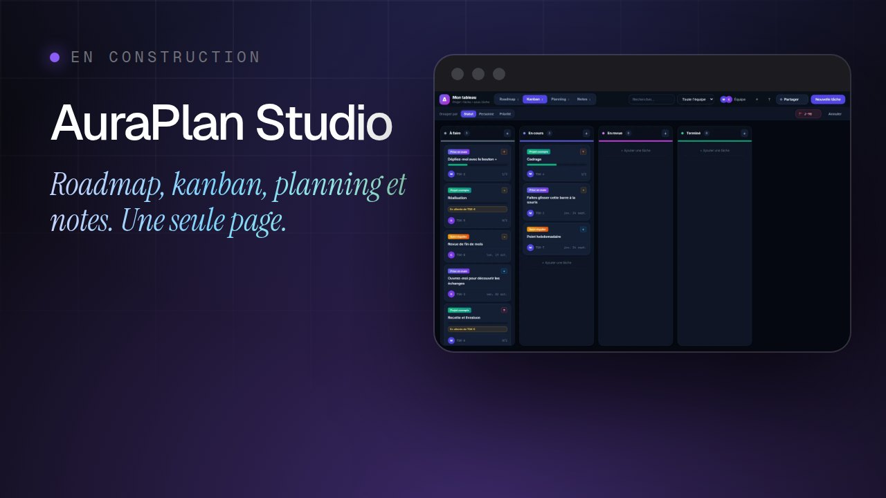</a> <a href="https://engob.github.io/EngoJira/">Essayer</a> · <a href="https://www.senshicore.com/projets/auraplan/">Fiche</a> · <a href="https://github.com/engoB/EngoJira">Code</a></td>
<td width="50%" valign="top"><a href="https://www.senshicore.com/projets/pokevault/">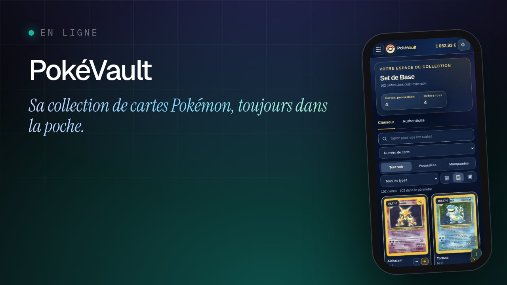</a> <a href="https://engob.github.io/PokeTest/">Ouvrir le classeur</a> · <a href="https://www.senshicore.com/projets/pokevault/">Fiche</a> · <a href="https://github.com/engoB/PokeTest">Code</a></td>
</tr>
<tr>
<td width="50%" valign="top"><a href="https://www.senshicore.com/projets/oasis/">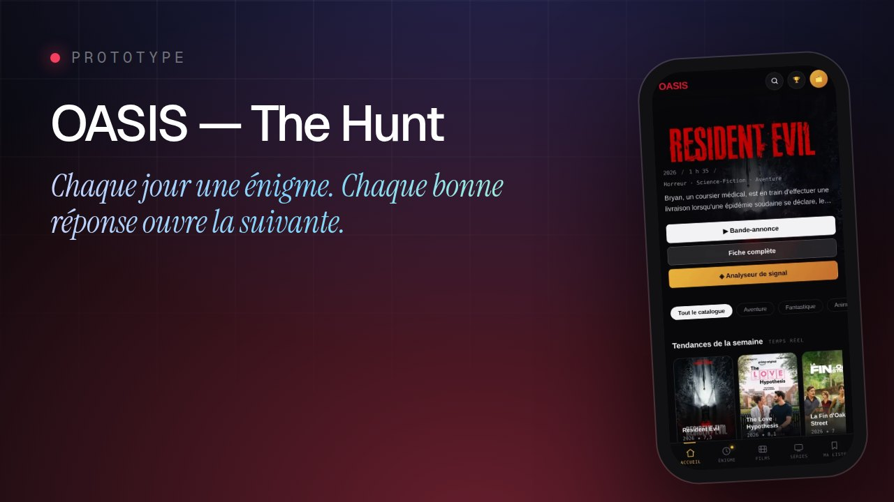</a> <a href="https://engob.github.io/chasse-oasis/">Entrer dans l'OASIS</a> · <a href="https://www.senshicore.com/projets/oasis/">Fiche</a> · <a href="https://github.com/engoB/chasse-oasis">Code</a></td>
<td width="50%" valign="top"><a href="https://www.senshicore.com/projets/diamond-foil/">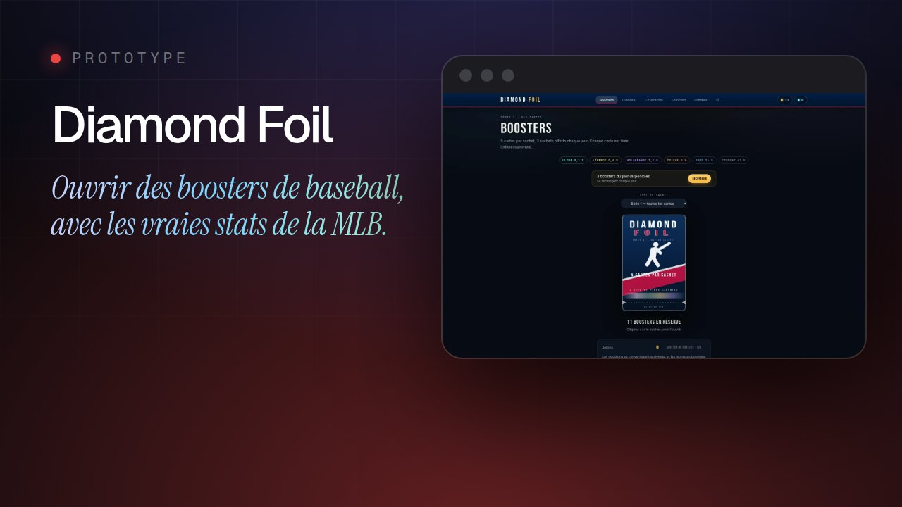</a> <a href="https://engob.github.io/DiamondLB/">Ouvrir un booster</a> · <a href="https://www.senshicore.com/projets/diamond-foil/">Fiche</a> · <a href="https://github.com/engoB/DiamondLB">Code</a></td>
</tr>
<tr>
<td width="50%" valign="top"><a href="https://www.senshicore.com/projets/site-evenement/">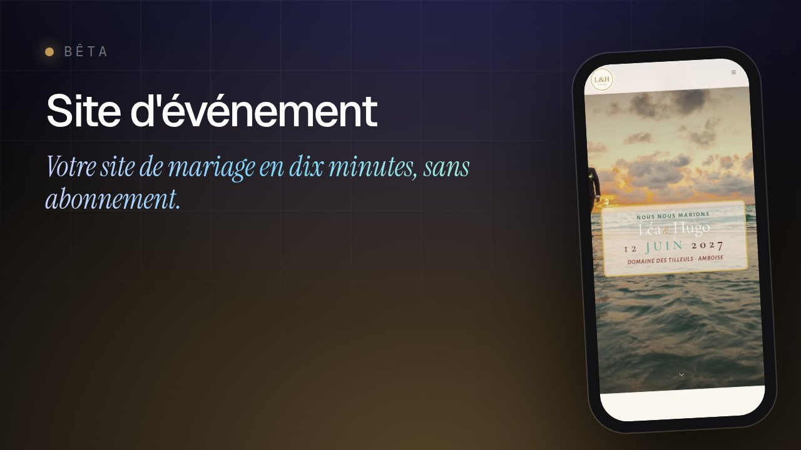</a> <a href="https://engob.github.io/site-evenement/">Voir la démo (mot de passe : demo)</a> · <a href="https://www.senshicore.com/projets/site-evenement/">Fiche</a> · <a href="https://github.com/engoB/site-evenement">Code</a></td>
<td width="50%" valign="top"><a href="https://www.senshicore.com/projets/planning-classe/">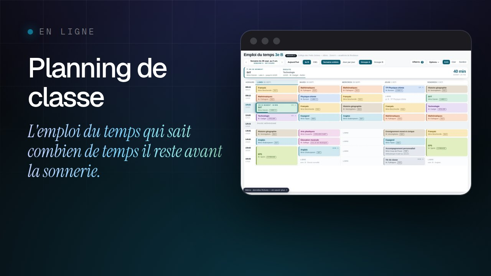</a> <a href="https://engob.github.io/planning-classe/">Voir la démo</a> · <a href="https://www.senshicore.com/projets/planning-classe/">Fiche</a> · <a href="https://github.com/engoB/planning-classe">Code</a></td>
</tr>
</table>

### Suivre l'expérimentation

Je raconte les avancées, les choix et les ratés dans le [carnet de bord](https://www.senshicore.com/journal/) ([RSS](https://www.senshicore.com/feed.xml)). Une critique, une idée, un problème qui mériterait son outil ? Les commentaires sont ouverts sous chaque billet.

© 2026 Senshi Kabai · senshi.core · Les dépôts publics sont publiés pour consultation, tous droits réservés.
